# Multi-Source Document Retrieval & QA System — Demo Walkthrough

## Table of Contents
- [High-Level Design](#high-level-design)
- [Architecture Overview](#architecture-overview)
- [Text Extraction & Ingestion Pipeline](#text-extraction--ingestion-pipeline)
- [Structured vs. Unstructured Separation](#structured-vs-unstructured-separation)
- [Client Separation & Data Isolation](#client-separation--data-isolation)
- [Query Routing](#query-routing)
- [Retrieval Pipeline](#retrieval-pipeline)
- [Answers to the 5 Queries](#answers-to-the-5-queries)
- [Technology Stack](#technology-stack)

---

## High-Level Design

### Business Need

Paint industry clients (Aurora Paints, Horizon Coatings) maintain product safety documentation in **mixed formats** — spreadsheets with numeric compliance limits and Word documents with regulatory guidance. Compliance teams need to query across both data types using natural language:

- *"What's the maximum VOC limit for product X in the EU?"* → requires **exact numeric lookup**
- *"Where is enhanced ventilation recommended?"* → requires **semantic search over narrative text**
- *"Which client has stricter limits?"* → requires **cross-client comparison from both stores**

### Solution

A **dual-store retrieval system** with intelligent query routing that:

1. **Ingests** heterogeneous documents (XLSX + DOCX + embedded images)
2. **Separates** structured spec data → SQL database, narrative text → vector database
3. **Routes** each query to the optimal retrieval strategy
4. **Synthesizes** grounded answers with source citations
5. **Enforces** strict client data isolation at every layer

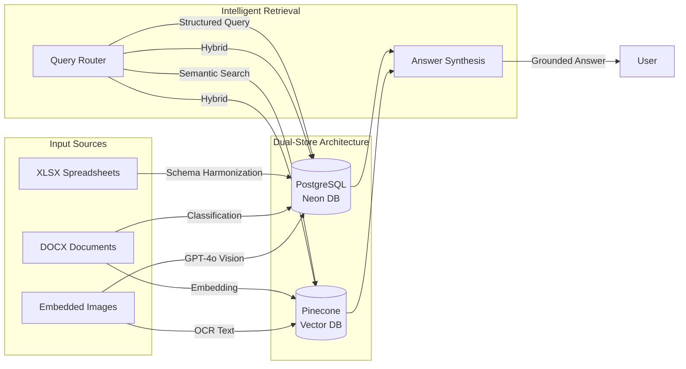

---

## Architecture Overview

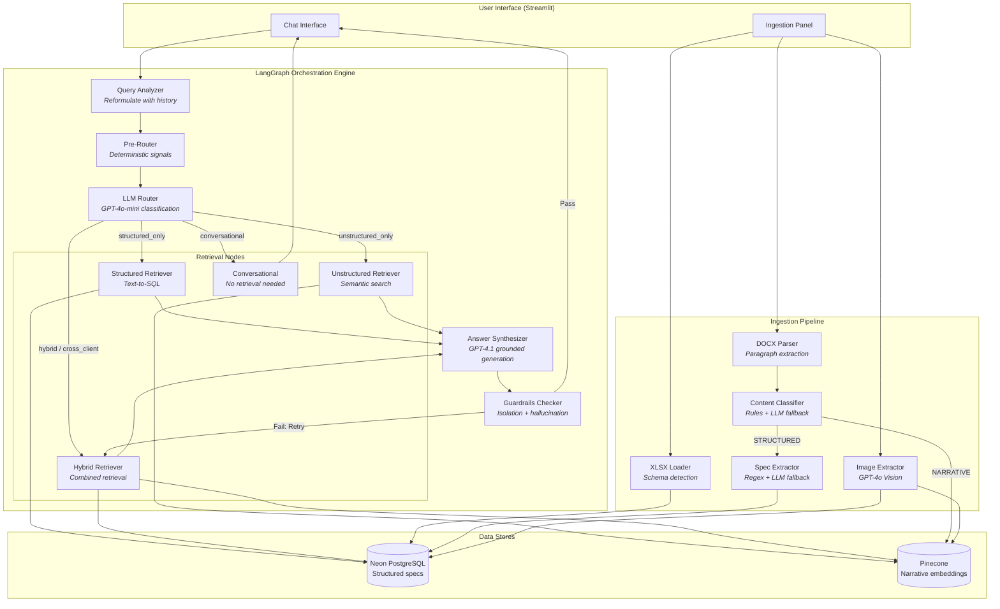

### Key Design Decisions

| Decision | Rationale |
|----------|-----------|
| **Dual-store** (SQL + Vector) | Numeric specs need exact queries (WHERE, MAX); narrative needs semantic search |
| **LangGraph** orchestration | Conditional routing + retry loops + state machine observability |
| **Two-tier routing** | Deterministic rules (free) → LLM classification (accurate) |
| **Namespace isolation** | Physically separate vector spaces per client (strongest possible) |
| **Tiered extraction** | Regex first (fast, free) → LLM fallback (handles edge cases) |

---

## Text Extraction & Ingestion Pipeline

### Overview

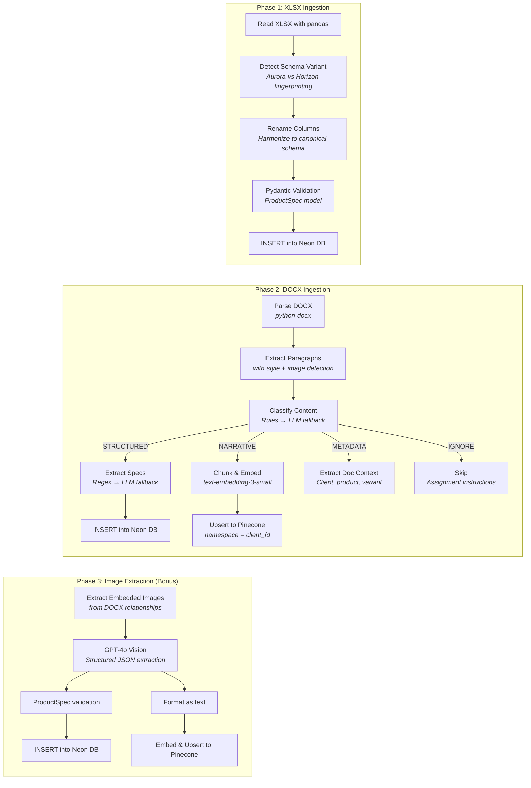

### Schema Harmonization

Aurora and Horizon use **completely different column names** for identical data:

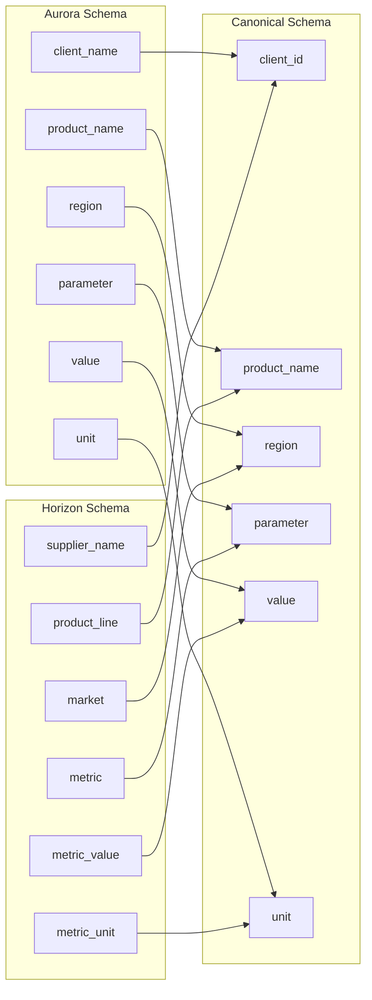

**Implementation:** Fingerprint-based auto-detection identifies the schema variant from column names, then applies the correct rename mapping. Adding a new client = one new fingerprint entry.

### Content Classification Strategy

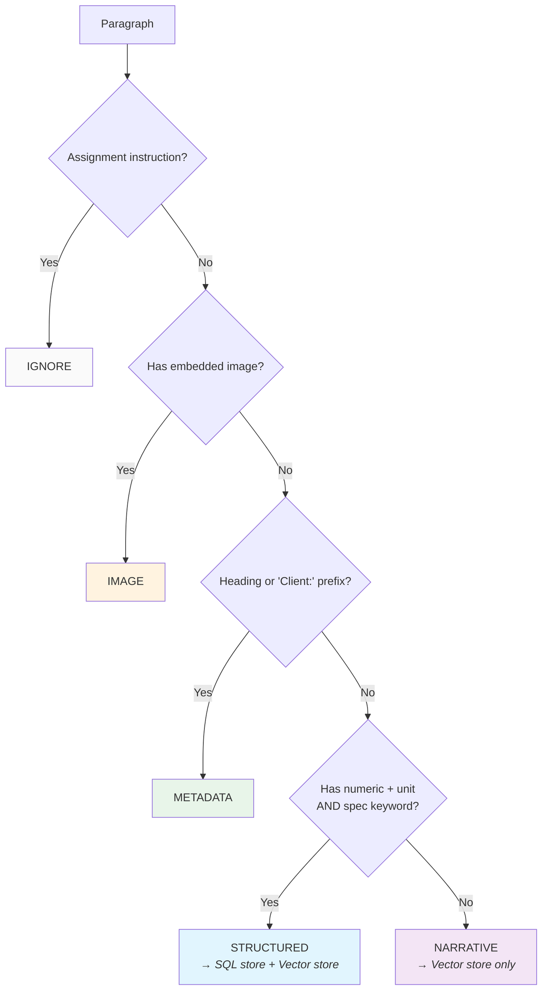

**Classification accuracy:** Rule-based classification handles ~95% of paragraphs deterministically. The remaining ~5% ambiguous cases fall through to an LLM classifier.

---

## Structured vs. Unstructured Separation

### What Goes Where

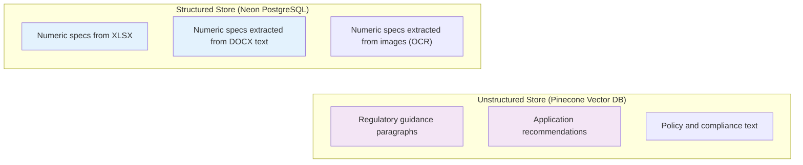

### Why Two Stores?

| Query Type | Best Store | Why |
|-----------|-----------|-----|
| "What is the max VOC for X?" | **SQL** | Exact filter + value lookup |
| "Maximum across 3 products?" | **SQL** | Aggregation (MAX, ORDER BY) |
| "What does guidance recommend?" | **Vector** | Semantic similarity search |
| "Summarize the policy for X" | **Vector** | Narrative comprehension |
| "Compare limits + explain context" | **Both** | Numeric comparison + narrative |

> **Key insight:** Embedding "30 g/L" as a vector loses its queryability. You can't do `MAX()` over embeddings. Conversely, stuffing narrative into SQL loses semantic richness.

---

## Client Separation & Data Isolation

### Three-Layer Defense Model

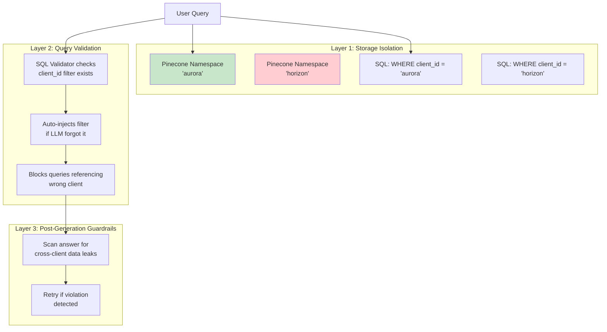

### Isolation Mechanisms in Detail

| Layer | Mechanism | Strength |
|-------|-----------|----------|
| **Pinecone Namespaces** | Queries to namespace "aurora" *physically cannot* return "horizon" vectors | **Architectural** — impossible to bypass |
| **SQL WHERE clause** | Every query validated to contain `client_id = '{client}'` | **Enforced** — auto-injected if missing |
| **Wrong-client detection** | SQL referencing `'horizon'` when scoped to `'aurora'` raises error | **Proactive** — catches LLM mistakes |
| **Guardrails checker** | Post-synthesis scan for mentions of unauthorized clients | **Defense-in-depth** — catches hallucination |

### SQL Validation Pipeline (Security-Critical)

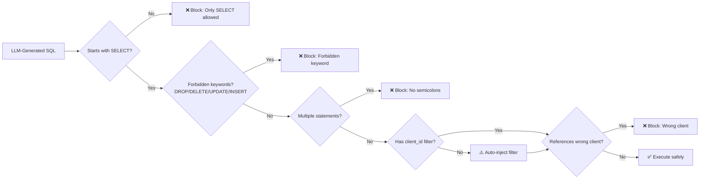

---

## Query Routing

### Two-Tier Routing Architecture

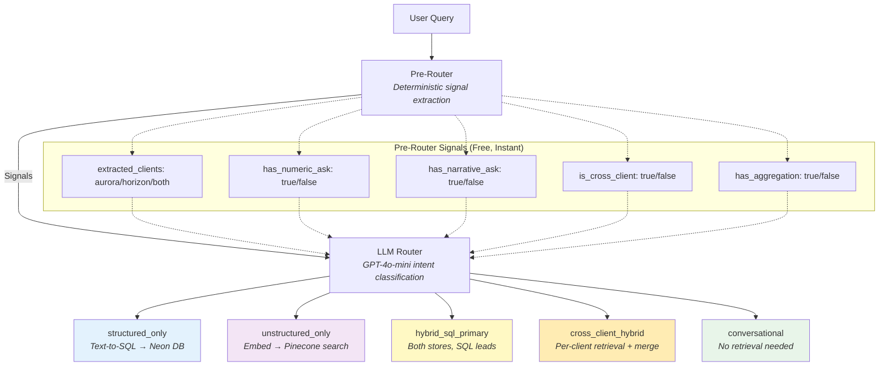

### Routing Decision Matrix

| Query Pattern | Pre-Router Signals | LLM Route Decision |
|--------------|-------------------|-------------------|
| Specific numeric value (limit, content) | `has_numeric_ask=True` | `structured_only` |
| Guidance, recommendations, policy | `has_narrative_ask=True` | `unstructured_only` |
| Numeric + contextual explanation | Both signals True | `hybrid_sql_primary` |
| Comparing two clients | `is_cross_client=True` | `cross_client_hybrid` |
| "Hello", "thanks", follow-up chat | Neither signal | `conversational` |

### Fallback Strategy

- **LLM confidence < 0.5** → Default to `hybrid_sql_primary` (over-retrieval is safer than under-retrieval)
- **LLM call fails** → Use pre-route signals heuristically
- **No data found** → Retry with broader retrieval strategy

---

## Retrieval Pipeline

### Structured Retrieval (Text-to-SQL)

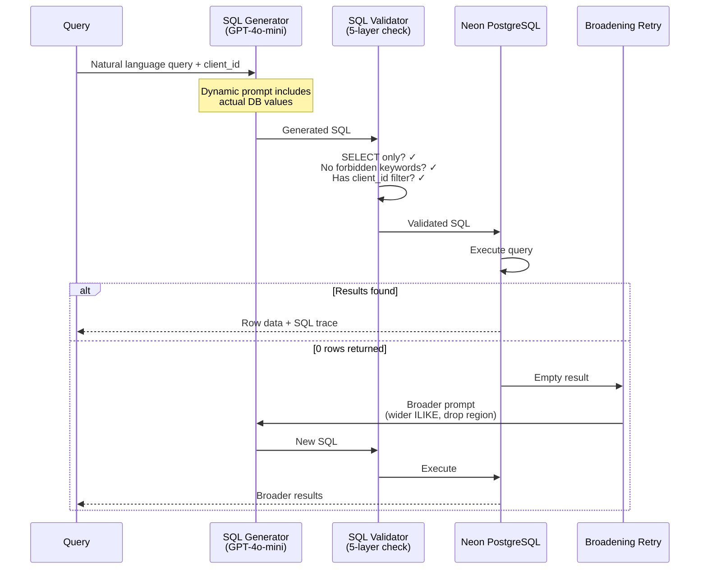

### Unstructured Retrieval (Semantic Search)

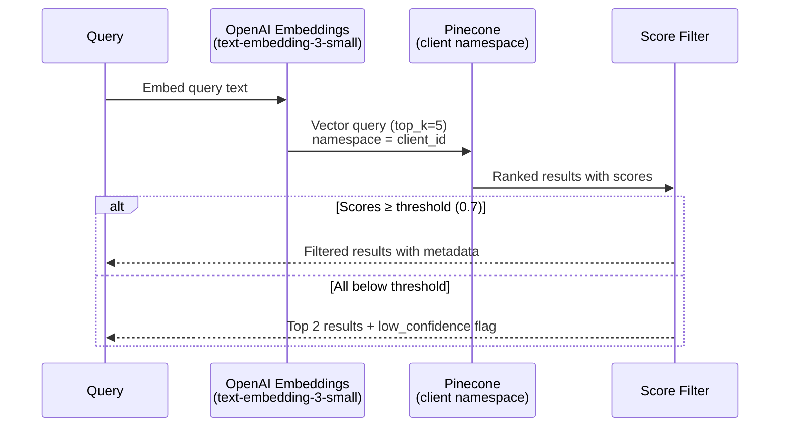

### Hybrid Retrieval (Cross-Client)

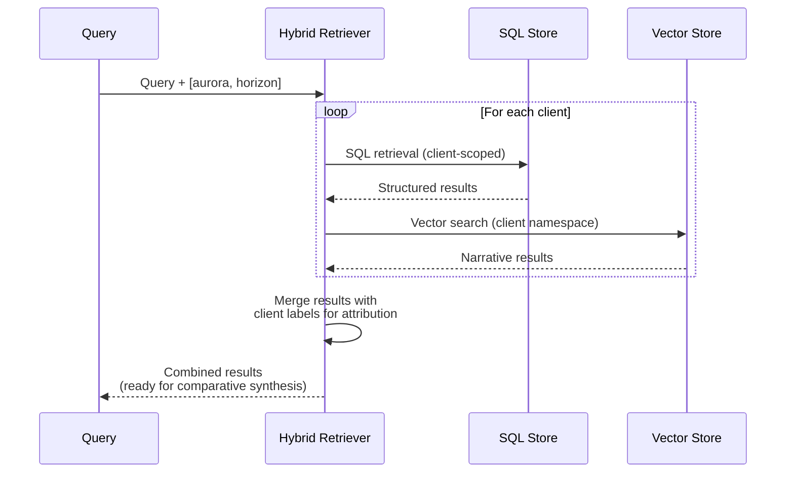

---

## Answers to the 5 Queries

### Query 1
> *"For client Aurora Paints, what is the maximum zinc content allowed in the finished EcoSafe Interior Wall Paint for the EU?"*

**Routing:** `structured_only` — numeric lookup, single client, specific product + region

**Retrieval:** Text-to-SQL generates:
```sql
SELECT product_name, parameter, value, unit 
FROM product_specs 
WHERE client_id = 'aurora' 
  AND product_name ILIKE '%Interior Wall%' 
  AND parameter ILIKE '%zinc%' 
  AND region = 'EU'
```

**Interpretation:** This is a direct specification lookup. The system queries the SQL store for Aurora's zinc content limit on their Interior Wall Paint in the EU market. The answer is a single numeric value with its unit, sourced from the structured product specs data.

---

### Query 2
> *"For client Aurora Paints, considering EcoSafe Ceiling Paint, EcoSafe Exterior Facade and EcoShield Floor Coating in the EU, what is the maximum internal VOC limit in g/L across these products?"*

**Routing:** `structured_only` — aggregation query, single client, multiple products

**Retrieval:** SQL with aggregation:
```sql
SELECT product_name, parameter, value, unit 
FROM product_specs 
WHERE client_id = 'aurora' 
  AND (product_name ILIKE '%Ceiling%' 
       OR product_name ILIKE '%Exterior%' 
       OR product_name ILIKE '%Floor%')
  AND parameter ILIKE '%voc%' 
  AND region = 'EU'
ORDER BY value DESC
```

**Interpretation:** The system identifies the MAX VOC value across 3 products by retrieving all matching rows and finding the highest value. This tests multi-product aggregation capability — the answer presents which product has the highest VOC limit and what that value is.

---

### Query 3
> *"According to the guidance for client Horizon Coatings' UltraSafe Interior Wall Paint, in which types of rooms is enhanced ventilation or longer airing-out periods specifically recommended?"*

**Routing:** `unstructured_only` — narrative/guidance question, semantic understanding needed

**Retrieval:** Semantic search in Pinecone namespace `horizon`, embedding the query and finding paragraphs about ventilation recommendations.

**Interpretation:** This query cannot be answered from SQL (no "room type" column exists). It requires understanding narrative guidance text. The system performs semantic search over Horizon's embedded paragraphs and synthesizes an answer listing specific room types mentioned in the safety guidance. The answer references the source DOCX document.

---

### Query 4
> *"Comparing client Aurora Paints and client Horizon Coatings, which client sets a stricter VOC limit for interior wall paint in the EU, and what additional usage guidance is mentioned for sensitive environments across their products?"*

**Routing:** `cross_client_hybrid` — cross-client comparison, numeric values + narrative guidance needed

**Retrieval:** Per-client hybrid retrieval:
- **SQL (Aurora):** VOC limit for Interior Wall Paint, EU → `30 g/L`
- **SQL (Horizon):** VOC limit for Interior Wall Paint, EU → `25 g/L`
- **Vector (both):** Semantic search for "sensitive environments usage guidance" → guidance paragraphs from both clients

**Interpretation:** This is a **cross-client hybrid query** — it needs both numeric comparison AND qualitative narrative. The system retrieves VOC limits from SQL for each client independently (maintaining isolation), then searches both vector namespaces for guidance on sensitive environments. The synthesis combines the numeric comparison with relevant usage recommendations from both clients' documents.

---

### Query 5
> *"For client Aurora Paints, what internal VOC limit in g/L is set for EcoSafe Kitchen & Bath in the EU for typical residential projects?"*

**Routing:** `structured_only` or `hybrid_sql_primary` — primarily a numeric lookup, but "typical residential projects" may trigger hybrid for context

**Retrieval:**
1. **SQL:** VOC limit for Kitchen & Bath, EU → numeric value (e.g., 32 g/L)
2. **Vector (if hybrid):** Semantic search for "residential projects Kitchen Bath" → contextual paragraphs

**Interpretation:** This query asks for a specific numeric value with a contextual qualifier ("typical residential projects"). The router may choose structured-only if it interprets this as a pure numeric lookup, or hybrid if the qualifier suggests narrative context is needed. Either way, the SQL store provides the definitive answer. If hybrid is triggered, the vector store may surface additional context about residential application scenarios.

---

## Technology Stack

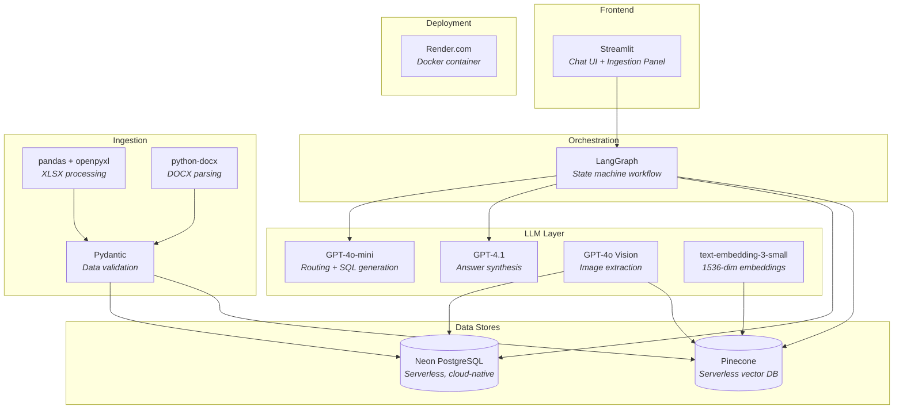

### Model Selection Rationale

| Model | Use Case | Why |
|-------|----------|-----|
| **GPT-4o-mini** | Routing, SQL generation, classification | Fast, cheap (~$0.001/call), sufficient for structured tasks |
| **GPT-4.1** | Answer synthesis | Higher quality reasoning for grounded, cited answers |
| **GPT-4o Vision** | Image spec extraction | Best-in-class multimodal understanding |
| **text-embedding-3-small** | Document + query embedding | Good quality at 1536 dims, cost-effective |

### Infrastructure

| Component | Choice | Rationale |
|-----------|--------|-----------|
| **SQL Database** | Neon (serverless PostgreSQL) | Cloud-native, no server management, connection pooling |
| **Vector Database** | Pinecone (serverless) | Namespace isolation, auto-scaling, no infra management |
| **Deployment** | Render.com + Docker | Simple deployment, auto-scaling, HTTPS |
| **UI Framework** | Streamlit | Rapid prototyping, built-in chat components |

---

## Summary: Key Engineering Highlights

1. **Intelligent Routing** — Two-tier (rules + LLM) routing picks the optimal retrieval path per query
2. **Defense-in-Depth Security** — 5-layer SQL validation + namespace isolation + guardrails
3. **Self-Healing Retrieval** — Broadening retry on 0 results; guardrails failure triggers re-retrieval
4. **Schema Harmonization** — Auto-detects and normalizes different client data formats
5. **Tiered Extraction** — Regex (free, fast) → LLM (accurate, costly) at every classification stage
6. **Full Observability** — Retrieval trace captures per-node execution for debugging
7. **Production-Grade Design** — Idempotent ingestion, error isolation, graceful degradation
