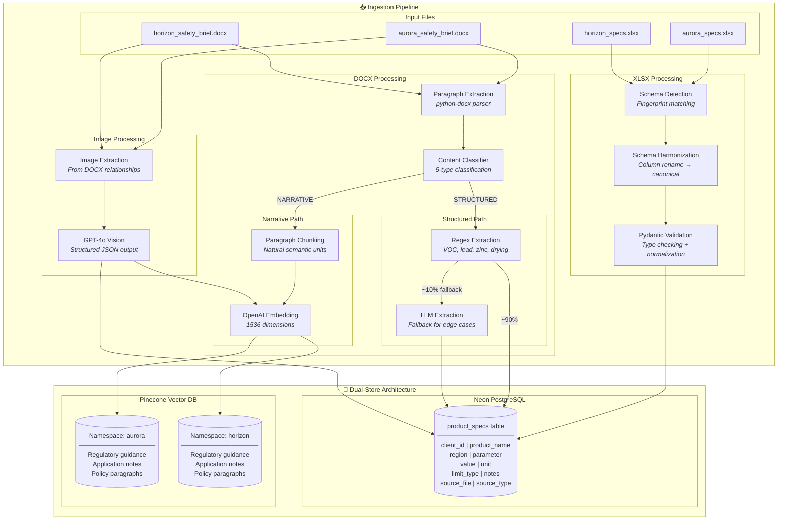
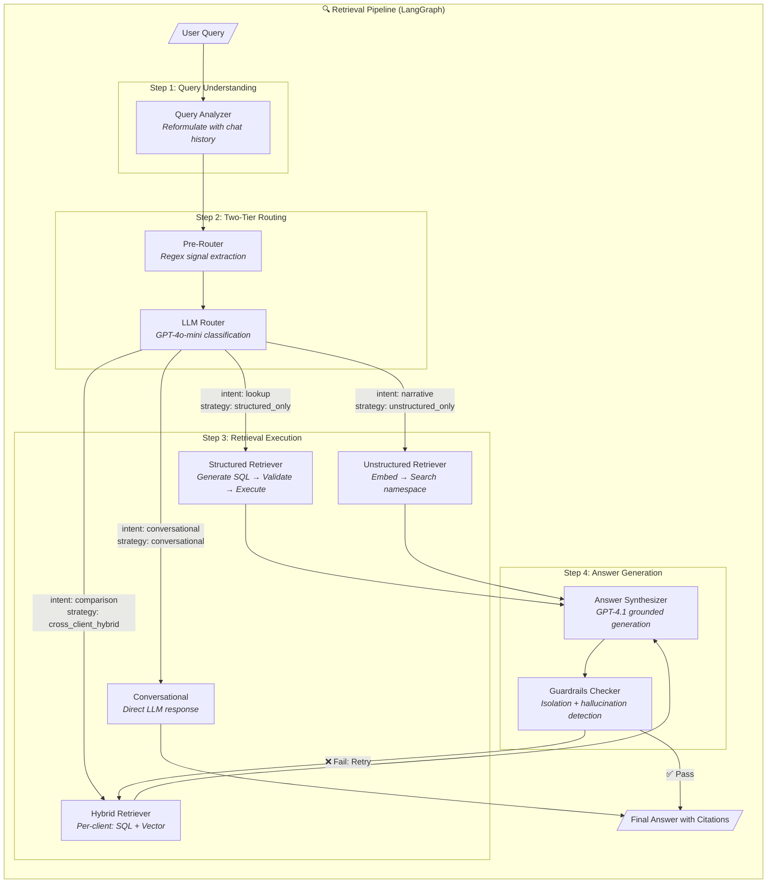
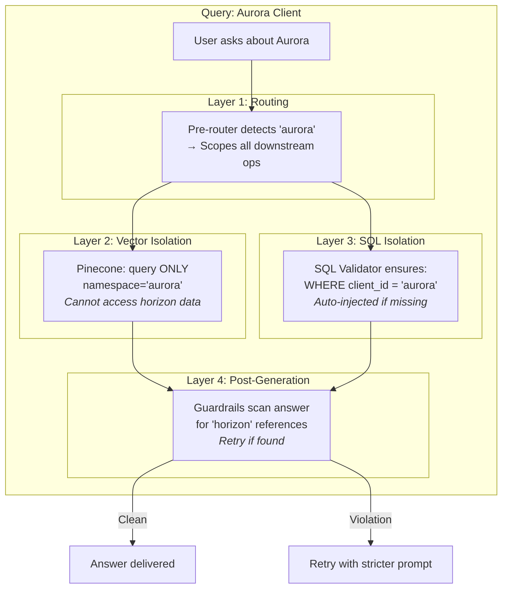
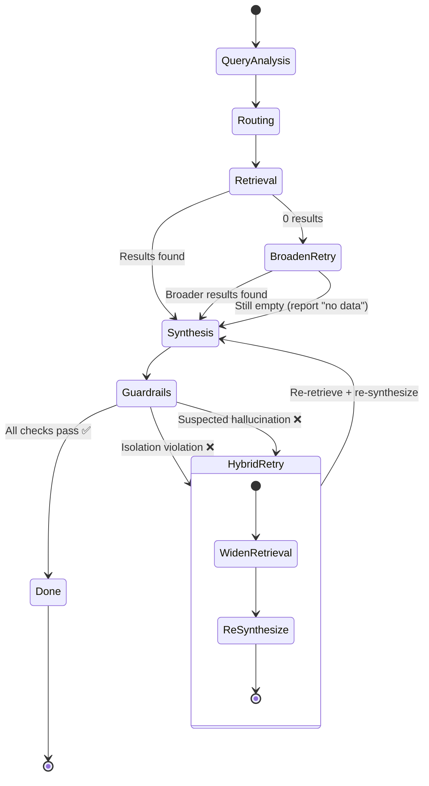
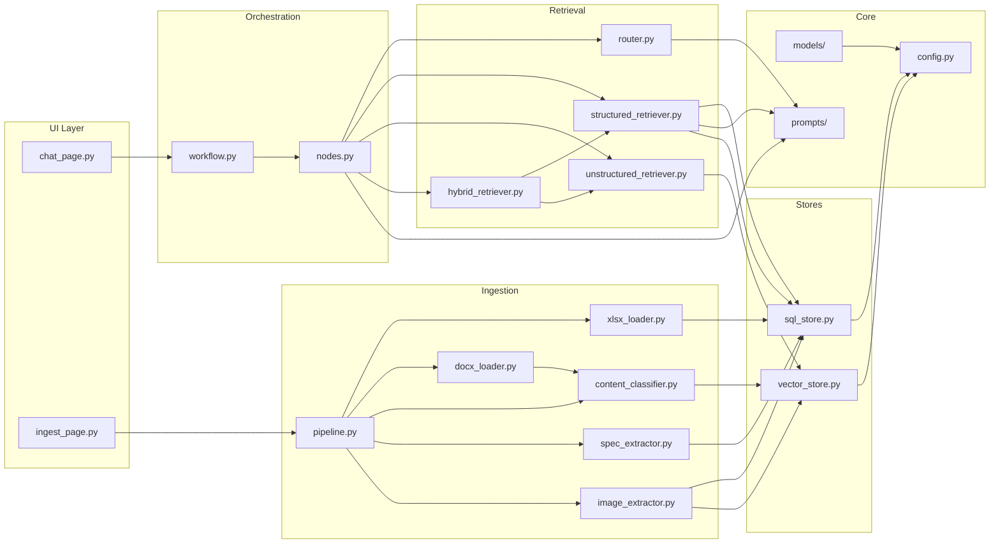

# System Architecture — Detailed Visual Reference

## Complete Data Flow

---

## Query Processing Flow

---

## Client Isolation Architecture

---

## Retry & Self-Healing Mechanism

---

## Module Dependency Map

---

## Performance Characteristics

| Component | Latency | Cost per Query |
|-----------|---------|---------------|
| Pre-router (regex) | <1ms | Free |
| LLM Router (4o-mini) | ~1.5s | ~$0.001 |
| SQL Generation (4o-mini) | ~1.5s | ~$0.001 |
| SQL Execution (Neon) | ~100ms | Free tier |
| Vector Search (Pinecone) | ~200ms | Free tier |
| Answer Synthesis (4.1) | ~3s | ~$0.01 |
| **Total (structured)** | **~6s** | **~$0.012** |
| **Total (hybrid)** | **~7s** | **~$0.013** |
